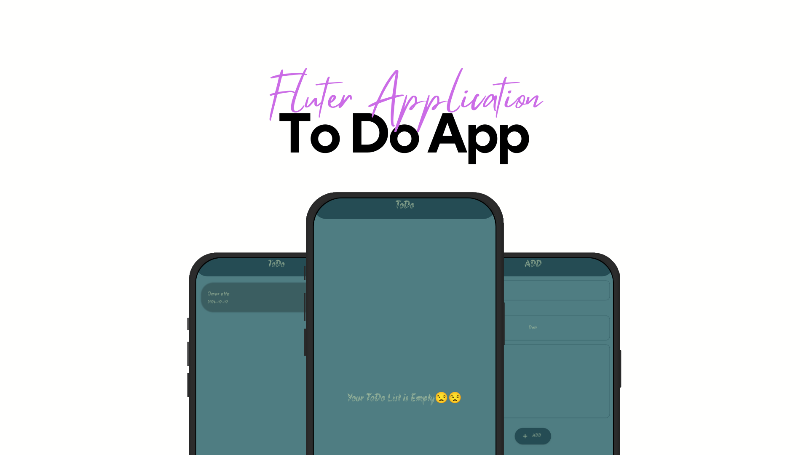
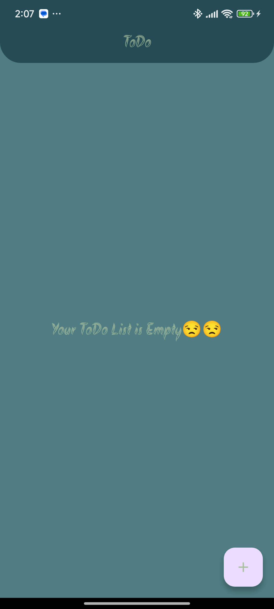
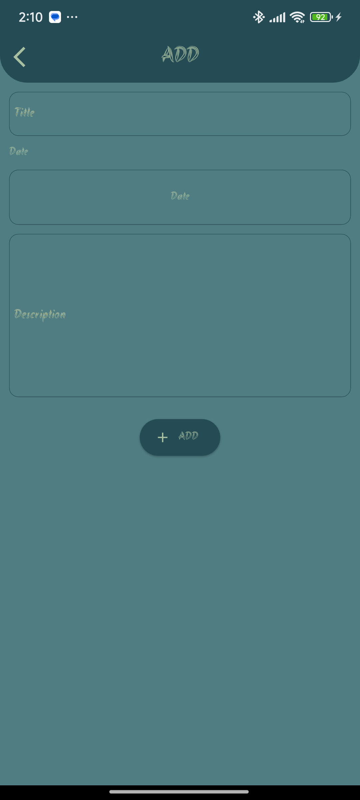
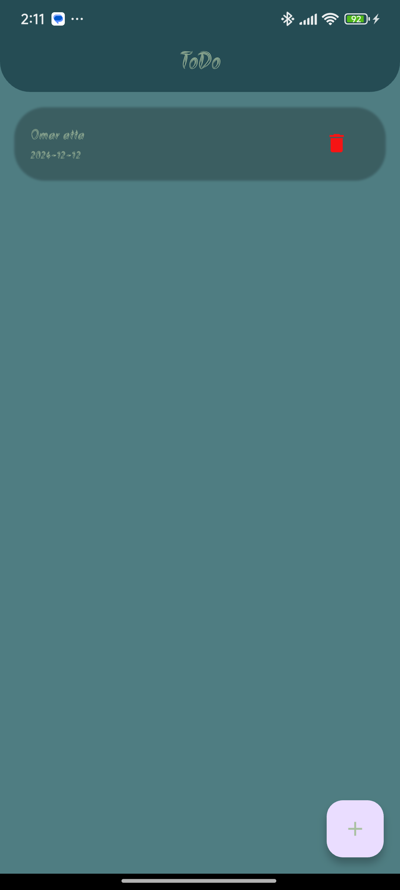

# Todo App  

## Overview  
The **Todo App** is a feature-rich Flutter-based application designed to help users manage their tasks efficiently. It incorporates advanced techniques such as using **Flutter Shared Preferences** for local data storage, **Google Fonts** for elegant typography, and a variety of Flutter widgets for a dynamic and user-friendly UI.

---

## Features  
- **Task Management**  
  - Add, edit, and delete tasks effortlessly.  
  - Mark tasks as completed or pending.  

- **Persistent Storage**  
  - Utilizes **Shared Preferences** to save and retrieve tasks locally, ensuring data is retained even after the app is closed.  

- **Elegant Typography**  
  - Integrates **Google Fonts** for a modern and consistent appearance.  

- **Dynamic Widgets**  
  - Employs a variety of Flutter widgets for custom UI elements like task cards, list views, and input forms.  

---

## Installation  
1. Clone the repository:  
   ```bash
   git clone https://github.com/omaratta2001/todo-app.git
   cd todo-app
2. Install dependencies:  
   ```bash
   flutter pub get

1. Run the app:  
   ```bash
   Run the app

## ScreenShots


## App Previews

|  |  |  |
|--------------------------------------------------------|--------------------------------------------------------|--------------------------------------------------------|
|                     Home Screen                      |                        Create Screen                     |                           Delete Screen                 |


